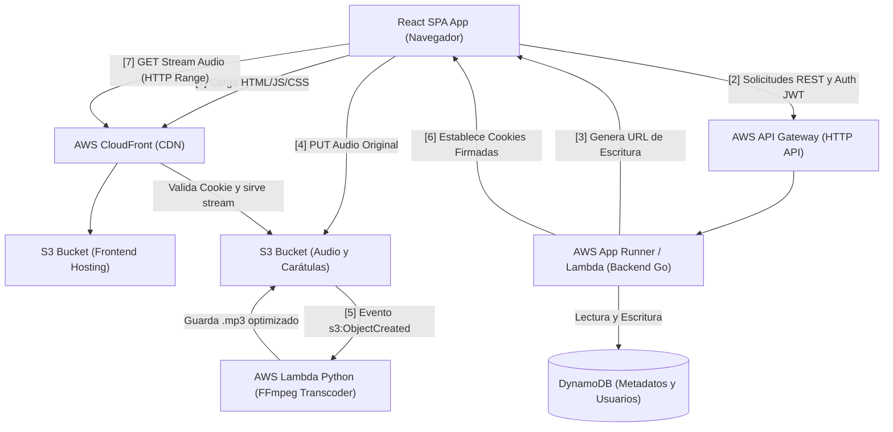

# Architecture Blueprint: Personal Music Streaming App

Este documento es el **Diseño de Arquitectura Cloud** detallado. Mapea cómo se interconectan los servicios de AWS, el flujo de datos para streaming de audio, y el plan de migración a futuro.

## 1. Arquitectura Fase 1: Serverless (Costo Optimizado)

En esta fase, evitamos correr servidores dedicados 24/7. El sistema reacciona a eventos y tráfico, reduciendo los costos al mínimo absoluto.



### Flujo de Subida de Archivos (El patrón "Presigned URL")
No pasaremos archivos pesados de audio a través de la API en Go, ya que servicios como API Gateway o Lambda tienen límites de tamaño (10MB y tiempos de timeout).
1. El usuario selecciona un `.flac` o `.mp3` en el Frontend.
2. El Frontend llama a `POST /api/upload-request` en el backend (Go).
3. El Backend en Go genera una **S3 Presigned URL** de escritura, y se la devuelve al Frontend.
4. El Frontend hace un `PUT` directo a S3 usando esa URL.
5. S3 emite un evento a una **Lambda de Python** para que extraiga la calidad web o transcodifique a otros formatos que el usuario pueda descargar luego.
6. La Lambda notifica al Backend (vía webhook o evento interno) para actualizar los metadatos en **DynamoDB**.

### Flujo de Streaming y Reproducción (CloudFront Signed Cookies)
Para evitar problemas de expiración de firma de URLs al pausar canciones de larga duración, se implementa el patrón de Cookies Firmadas:
1. Al iniciar sesión exitosamente, el Backend en Go establece en el navegador tres **CloudFront Signed Cookies** (`CloudFront-Policy`, `CloudFront-Signature`, `CloudFront-Key-Pair-Id`) válidas por 12-24 horas.
2. Cuando el reproductor de React inicia una canción, solicita la URL limpia al CDN: `GET https://media.kowamusicstream.com/songs/<id>.mp3`.
3. El navegador adjunta automáticamente las Cookies en la petición de cabecera HTTP.
4. CloudFront valida la firma de la cookie y transmite el audio de forma nativa e ilimitada (soportando peticiones HTTP Range de forma nativa), sin sobrecargar el backend de Go y resolviendo la expiración ante pausas largas.

---

## 2. Esquema de Base de Datos (DynamoDB)

DynamoDB requiere un enfoque distinto al relacional. Usaremos un patrón de diseño **Single Table Design**.

**Tabla:** `MusicDB`

| Patrón de Acceso | Partition Key (PK) | Sort Key (SK) | Atributos Adicionales |
| :--- | :--- | :--- | :--- |
| **Obtener Perfil de Usuario** | `USER#<email>` | `PROFILE` | `Name`, `PasswordHash`, `Role` |
| **Obtener Canción** | `TRACK#<id>` | `METADATA` | `Title`, `Artist`, `Album`, `Duration`, `S3Key`, `Format` |
| **Listar Canciones del Usuario** | `USER#<email>` | `TRACK#<id>` | *GSI (Índice Secundario Global) para consultar por fecha* |
| **Detalles de Playlist** | `PLAYLIST#<id>` | `METADATA` | `Name`, `CoverUrl` |
| **Canciones en Playlist** | `PLAYLIST#<id>` | `TRACK#<track_id>` | `Order`, `AddedAt` |

*Para entorno local, usaremos `dynamodb-local` corriendo en Docker Compose en el puerto 8000.*

---

## 3. Entornos en la Nube y CI/CD (Monorepo)

La distribución del monorepo y su interacción con **GitHub Actions** usando `paths`:

```bash
/
├── .github/workflows/
│   ├── backend.yml   # Trigger: paths ['backend/**']. Aplica: Go tests, build Lambda.
│   ├── frontend.yml  # Trigger: paths ['frontend/**']. Aplica: npm build, S3 sync.
│   └── infra.yml     # Trigger: paths ['infra/**']. Aplica: cdk deploy.
├── backend/          # API en Go
├── frontend/         # React SPA
└── infra/            # AWS CDK (Python)
```

**Estrategia de Despliegue:**
* Las subidas a la rama `dev` despliegan automáticamente en las cuentas/stacks de AWS configurados para "Dev".
* Las subidas a `qa` y `master` requerirán la funcionalidad **GitHub Environments**, pausando el pipeline hasta que un revisor (tú) apruebe manualmente el despliegue a los entornos críticos. Esto te permite un control microscópico sobre lo que sale a la nube.

---

## 4. Fase 2: Roadmap de Evolución a Contenedores Distribuídos

Tal como se planeó, una vez que la versión Serverless sea madura, el sistema se migrará para simular una infraestructura altamente distribuida empresarial, lo que demostrará conocimientos arquitectónicos avanzados:

1. **VPC de 3 Capas:** 
   Subredes Públicas (NAT Gateway, Load Balancers), Privadas (Contenedores) y Aisladas (Bases de datos).
2. **AWS ECS (Fargate):** 
   El backend en Go dejará de ser Serverless (Lambda/AppRunner) y se ejecutará dentro de contenedores en ECS. Estará alojado en las subredes privadas.
3. **Application Load Balancer (ALB):** 
   Se ubicará en la subred pública, interceptará el tráfico HTTPS (con un certificado gestionado por ACM asociado a tu dominio de Route 53) y ruteará el tráfico a los contenedores de ECS.
4. **AWS RDS (PostgreSQL):** 
   Migración de los datos relacionales (Usuarios, Playlists, Tracks) de DynamoDB hacia PostgreSQL. (AWS DMS puede usarse o scripts de migración manuales).
5. **Seguridad (Least Privilege):** 
   Las Tasks de ECS tendrán Roles de IAM ultra-restrictivos, permitiendo *solamente* acceso al bucket S3 específico de la música, y nada más.
